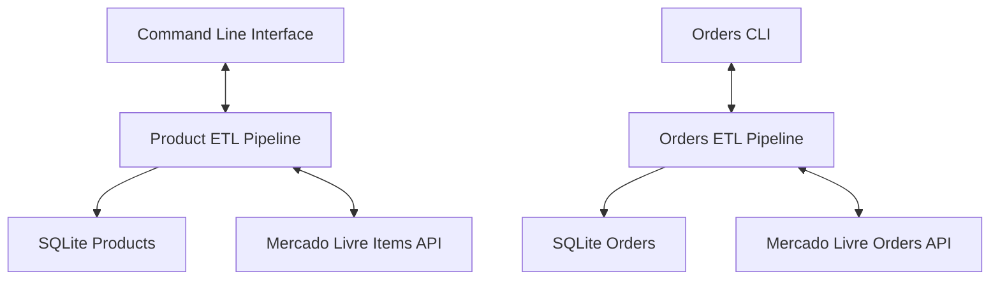

**[](https://www.python.org/)**
**[](https://github.com/victorliquiddata/noneca_com_v2/actions)**
**[](LICENSE)**

# Mercado Livre Analytics Platform

Comprehensive ETL Pipeline & Business Intelligence for **Noneca.com**

**Production-ready e-commerce analytics platform** integrating with Mercado Livre Brasil’s API for marketplace intelligence. Built for intimate apparel retailer **noneca.com**, this project demonstrates end-to-end data engineering: dual ETL pipelines, interactive CLI, and automated insights.

---

## 📖 Table of Contents

1. [Project Overview](#project-overview)
2. [Key Features](#key-features)
3. [Architecture](#architecture)
4. [Getting Started](#getting-started)
5. [Documentation](#documentation)
6. [License](#license)

---

## Project Overview

* **Marketplace**: Mercado Livre Brasil (MLB)
* **Focus**: Intimate apparel analytics & BI
* **Data Sources**: Product Catalog & Order Transactions
* **Storage**: SQLite + SQLAlchemy ORM
* **Interface**: CLI & (future) Web Dashboard

---

## Key Features

* **Dual ETL Pipelines**: Separate workflows for products and orders
* **Interactive CLI**: Single extraction strategy for items and main Business analytics, Flexible extraction strategies for orders (last 100, 500, 5000, all available), all of them via offset pagination 
* **OAuth 2.0**: Secure ML API integration with token management
* **Automated Enrichment**: Conversion rates, discounts, and sales metrics
* **Comprehensive Testing**: 99 tests passing with pytest (1 skippped due to API upstream deficiency)

---

## Architecture

<details>
<summary><strong>🔧 System Architecture (click to expand)</strong></summary>



</details>

---

## Getting Started

1. **Clone the repo**

   ```bash
   git clone https://github.com/victorliquiddata/noneca_com_v2.git
   cd noneca_com_v2
   ```
2. **Set up environment**

   ```bash
   python -m venv venv
   source venv/bin/activate  # or `venv\Scripts\activate` on Windows
   pip install -r requirements.txt
   ```
3. **Configure credentials**
   Create a `.env` file:

   ```ini
    # MercadoLibre API Configuration
    ML_CLIENT_ID=your_id
    ML_CLIENT_SECRET=your_secret
    ML_REDIRECT_URI=your_uri

    # API Configuration
    API_TIMEOUT=30
    RATE_LIMIT=100

    # Fallback Tokens
    ACCESS_TOKEN=your_token
    REFRESH_TOKEN=your_refresh
    TOKEN_EXPIRES=your_token_exp
   ```
4. **Run ETL**

   ```bash
   # Products pipeline
   python main.py

   # Orders pipeline (interactive)
   python scripts/fetch_orders_cli.py
   ```

---

## Documentation

* **ETL Architecture**: `docs/etl_architecture.md`
* **Database Schema**: `docs/database_schema.md`
* **Usage Guide**: `docs/usage_guide.md`
* **Development Log**: `docs/development_log.md`

---

## License

This project is licensed under the MIT License. See [LICENSE](LICENSE) for details.
